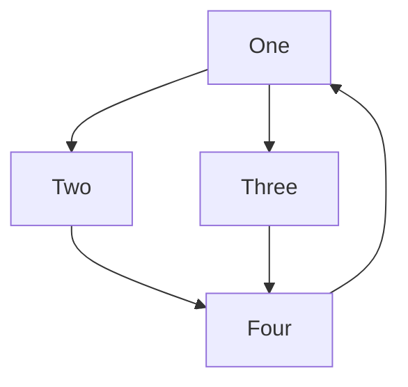

# This is my *Markdown* sandbox
Initial doc to copy to.

---------

I will edit this file to practice md.
# First heading
## Second heading
### And a third one
Here is some **bold** text and *italicized* text, and now **both *bold and italic*** text.
The following

> line of text

is a blockquote. And some C code:
`printf("Hi markdown!");`

---------

Some C code block:
```c
void fun() {
  printf("Hi C again!");
}
```
I can C a simple example, you see?

A _details_ HTML tag:
<details>
  <summary>Open ↔️ me</summary>
  <div style="border-left: 2px solid #ffd0a0;">
    And then close me.
  </div>
</details>

# Another first-heading
## Newlines formatting
Trying simple newline, not paragraph.\
This should be the newline.

Also in a list.
- This is 1st level.
- - Second level.
Now for starting with 2nd.
 - Second maybe?
 - - Or even 3rd.

## Math & diagrams
Trying some math.
$f(x)=A cos(\omega x + \varphi_0)$

### First try again some code format
```py
# Python code
def fun(name):
  print('That's funny, {_s}!'.format(_s = name))

fun('Doe')
```
and
```js
// Some JS code
f = s => console.log(`That's funny, ${s}!`);
f('Joe');
```
### Now diagrams
Let's see if `mermaid` works.


 Anything?

